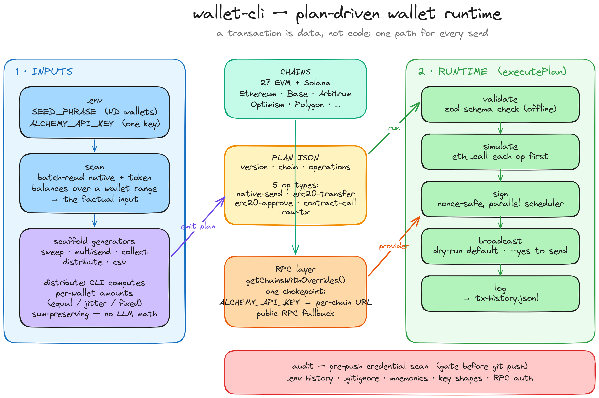

<div align="center">

# wallet-cli

**A plan-driven CLI for burner-wallet operations across EVM chains.**

[](package.json)
[](package.json)
[](https://www.typescriptlang.org/)
[](tests/)

You describe **what** to do in a small JSON file. `wallet-cli` validates it,
simulates it, signs it, broadcasts it, and logs the result. One code path for
every transaction — no surprises.

[Why](#why) · [Quick start](#quick-start) · [How it works](#how-it-works) · [Commands](#commands) · [Recipes](#recipes) · [Safety](#safety) · [Troubleshooting](#troubleshooting)

</div>

## Architecture



Inputs (`.env`, `scan`, `scaffold`) produce a **plan** — plain JSON. One runtime
executes every plan through the same five steps, pulling RPC from a single
Alchemy-backed chokepoint. `audit` gates every push.

## Why

Most wallet scripts are a pile of one-off snippets. This one is built around a
single idea: **a transaction is data, not code.** A plan is a JSON file. The
runtime is the only thing that touches a private key, and it always does the
same five steps:

```
validate → simulate → sign → broadcast → log
```

That means every operation — a single send, a 200-wallet sweep, a multi-step
approve-then-swap — is reproducible, dry-runnable, and auditable before a single
wei moves.

## Features

- **One runtime, seven op types** — `native-send`, `erc20-transfer`, `erc20-approve`, `erc721-transfer`, `erc721-approve`, `contract-call`, `raw-tx`
- **Scaffold generators** — `sweep`, `multisend`, `collect`, `distribute`, `csv` write ready-to-run plan JSON
- **`scan`** — batch-read native + token balances across a wallet range; the factual input for sweep/distribute
- **`distribute`** — split a balance across many wallets; the CLI does the math (equal / jitter / fixed), never you
- **Universal value format** — `"usd:1.50"`, `"wei:1234"`, `"raw:1000"`, `"all"`, `"unlimited"`
- **One Alchemy key, every chain** — set `ALCHEMY_API_KEY` and RPC URLs build themselves; public fallback otherwise
- **Parallel execution** — distinct wallets run concurrently, same-wallet ops stay sequential (nonce-safe)
- **`audit`** — pre-push credential scan: catches leaked keys before you `git push`
- **On-chain history log** — query every action by chain, plan, status, hash, or date

## Quick start

> [!TIP]
> **AI agents:** this repo ships an [Agent Skill](.claude/skills/wallet-cli/SKILL.md) (`.claude/skills/wallet-cli/`) that Claude Code auto-discovers — it triggers whenever you work with wallets, plans, or this tool. For a plain install walkthrough see [`docs/INSTALL.md`](docs/INSTALL.md).

```bash
git clone https://github.com/oxkage/wallet-cli.git
cd wallet-cli
npm install
npm run build
```

Configure two secrets:

```bash
cp .env.example .env
```

```ini
SEED_PHRASE="your twelve or twenty-four word mnemonic"
ALCHEMY_API_KEY="your-alchemy-key"   # one key, all chains
```

Dry-run the hello-world plan (never broadcasts):

```bash
node dist/index.js run examples/hello.json
```

Broadcast for real when you're ready:

```bash
node dist/index.js run examples/hello.json --yes
```

> [!TIP]
> Use `npm run dev -- <cmd>` to run from source without rebuilding.

## Environment

Only two variables matter. Everything else is optional.

| Variable | Required | What it does |
| --- | --- | --- |
| `SEED_PHRASE` | **yes** | BIP-39 mnemonic (12/24 words). All EVM wallets derive from it. |
| `ALCHEMY_API_KEY` | recommended | One key → RPC for every supported chain. The CLI builds each chain's Alchemy endpoint from this key. Unsupported chains fall back to a bundled public RPC. |
| `BURNER_WALLETS_FILE` | optional | Path to a JSON wallet source, as an alternative to deriving from `SEED_PHRASE`. |
| `LOG_LEVEL` | optional | `info` / `warn` / `error` / `debug` |

> [!NOTE]
> **You no longer set RPC URLs by hand.** Drop in one Alchemy key and the CLI
> builds the right endpoint per chain. Run `wallet-cli chains list` to see
> exactly which URL each chain resolves to.

> [!WARNING]
> `.env` is local-only — never commit it. Run `wallet-cli audit` before every push.

## How it works

A plan is validated against a zod schema, then `executePlan()` handles nonce
management, gas estimation, simulation, signing, broadcasting, and history
logging — in that order, for every op.

### Plan JSON

```jsonc
{
  "version": 1,
  "name": "my-plan",              // optional — shows up in history/logs
  "chain": "Base",                // a name from `chains list`
  "defaultFromIndex": 0,          // derivation index for ops without their own `from`
  "operations": [
    { "id": "a", "type": "native-send", "to": "0x...", "value": "0.01" },
    { "id": "b", "type": "erc20-transfer", "fromIndex": 0, "token": "USDC", "to": "0x...", "amount": "100" },
    { "id": "c", "type": "erc20-approve", "token": "USDC", "spender": "0xROUTER", "amount": "unlimited" }
  ],
  "options": {
    "batchSize": 1,               // >1 runs distinct wallets in parallel (nonce-safe)
    "simulate": true,             // eth_call each op before broadcasting
    "stopOnError": false          // halt at first failure
  }
}
```

### Value format

Any `value` / `amount` field accepts:

| Input | Meaning |
| --- | --- |
| `"0.01"` | natural units, scaled by the token's decimals |
| `"wei:1234"` | explicit wei (native token) |
| `"raw:1234"` | explicit base units (no decimal conversion) |
| `"usd:1.50"` | convert at the current USD price |
| `"all"` | full balance (native: minus gas reserve · ERC-20: live `balanceOf`) |
| `"unlimited"` | `MaxUint256` (approvals only) |

### Op types

| Type | Required fields | What it does |
| --- | --- | --- |
| `native-send` | `id, to, value` | Send the native gas token (ETH, MATIC, …) |
| `erc20-transfer` | `id, token, to, amount` | `transfer(to, amount)`. `token` is a registry symbol or 0x address. `"all"` reads `balanceOf` on-chain. |
| `erc20-approve` | `id, token, spender, amount` | `approve(spender, amount)`. Use `"unlimited"` for `MaxUint256`. |
| `erc721-transfer` | `id, contract, tokenId, to` | Transfer an NFT. Verifies ownership first. `safeTransferFrom` by default; set `safe:false` for `transferFrom`. |
| `erc721-approve` | `id, contract, spender` + `tokenId` _or_ `all` | `approve(spender, tokenId)` for one NFT, or `setApprovalForAll(spender, approved)` when `all:true`. `approved:false` revokes. |
| `contract-call` | `id, to, fn, args, abi?` | Encode any call. `fn` as a full signature (e.g. `mint(uint256,uint256)`) needs **no ABI**. `abi` only for bare fn names — built-in alias (`erc20`/`erc721`/`permit2`), inline JSON, or a file path. |
| `raw-tx` | `id, from, to, data` | Fully manual EIP-1559 tx with raw calldata. |

Discover them live: `wallet-cli ops list` · `wallet-cli ops describe <type>`.

## Commands

```
wallet-cli
├── run [plan]            EXECUTE a plan — dry-run by default, --yes to broadcast
├── validate [plan]       check .env + plan schema, simulate (no RPC needed)
├── scan                  batch-read balances across a wallet index range → JSON
├── scaffold              generate plan JSON (never broadcasts)
│   ├── sweep             drain wallets of native + tokens over a range
│   ├── multisend         one op per recipient
│   ├── collect           single-token sweep across a range
│   ├── distribute        split a balance across a target range (CLI does the math)
│   └── csv <file>        build plans from a CSV, auto-split per chain
├── ops                   list / describe registered op types
├── balance               native + token balances for an address
├── history               query the on-chain action log
├── chains                list / test-rpc / enable / disable chains
├── collect-tokens        CRUD for the per-chain token registry
├── wallet                reindex / resolve a wallet by address
├── export                export public wallet fields only
├── audit                 pre-push credential scan
└── tx                    legacy: tx send (wraps the runtime)
```

## Recipes

### Run a plan

```bash
node dist/index.js validate ./plan.json   # schema + simulate, offline
node dist/index.js run ./plan.json         # dry-run (default, never broadcasts)
node dist/index.js run ./plan.json --yes   # broadcast for real
cat plan.json | node dist/index.js run --yes   # pipe from stdin
```

### Consolidate then redistribute (scan → sweep → distribute)

The headline workflow. The CLI reads balances and computes every amount — you
only state intent. No mental arithmetic, no rounding bugs, no lost wei.

```bash
# 1. SCAN — read the facts (don't guess balances)
node dist/index.js scan --chain Base --from 10 --to 50 --include native,USDC --json

# 2. SWEEP — drain that range into one collector wallet
node dist/index.js scaffold sweep --chain Base --from-idx 10 --to-idx 50 \
  --to 0xCollector --include native,USDC --out sweep.json
node dist/index.js run sweep.json --yes

# 3. DISTRIBUTE — split the collector balance across a fresh range
node dist/index.js scaffold distribute --chain Base --from 0xCollector \
  --to-idx 51 --to-idx-end 80 --amount all --split equal \
  --reserve-gas 0.01 --out dist.json
node dist/index.js run dist.json --yes
```

Split strategies for `distribute`:

| `--split` | Behavior |
| --- | --- |
| `equal` | total ÷ N, exact. Remainder dust goes to the first wallet — no wei lost. |
| `jitter` | `equal` ± a random `--jitter` %, seeded and reproducible. Sum still exact. |
| `fixed` | `--per <amount>` to each target. Fails if the source can't cover all of them. |

### Generate other plans

```bash
# Multisend: one op per recipient
node dist/index.js scaffold multisend --chain Base --from 0 \
  --recipients "0xaaa:0.1,0xbbb:0.2,0xccc:usd:1.00" --out multi.json

# Collect: single-token sweep
node dist/index.js scaffold collect --chain Base --token USDC \
  --from-idx 0 --to-idx 199 --to 0xDest --out collect.json

# CSV: one plan file per chain
node dist/index.js scaffold csv recipients.csv --out out/multi
# → out/multi.base.json, out/multi.optimism.json, …
```

### NFTs (ERC-721)

NFTs are identified by **collection address + tokenId** — there's no "list my
tokens" call in the ERC-721 standard, so ownership is enumerated via the
**Alchemy NFT API** (set `ALCHEMY_API_KEY`). Without a key it falls back to
on-chain `ERC721Enumerable`, which only works for collections that implement it.

```bash
# Sweep: drain every owned NFT of a collection, from a wallet range, to one dest
node dist/index.js scaffold sweep-nft --chain Base --contract 0xCollection \
  --from-idx 0 --to-idx 50 --to 0xVault --out nft-sweep.json
node dist/index.js run nft-sweep.json --yes

# Distribute: spread one wallet's NFTs across many recipients (round-robin)
node dist/index.js scaffold distribute-nft --chain Base --from 0 \
  --contract 0xCollection \
  --recipients 0xaaa,0xbbb,0xccc --out nft-dist.json
node dist/index.js run nft-dist.json --yes

# Distribute specific tokenIds (skips enumeration — no key needed)
node dist/index.js scaffold distribute-nft --chain Base --from 0 \
  --contract 0xCollection --recipients 0xaaa,0xbbb --token-ids 100,101,102
```

Both emit `erc721-transfer` ops (`safeTransferFrom` by default; `--unsafe` for
plain `transferFrom`). Each op re-verifies ownership on-chain at run time, so a
stale enumeration can't push a doomed transfer.

### Batch contract calls (mint / claim / register)

`call-range` broadcasts the **same** contract call from every wallet in an index
range — the canonical pattern for minting or claiming from many burner wallets
with fixed params. One `contract-call` op per index; the fn signature and args
are validated **once up front** (encoded with ethers), so a bad fn/arg fails
immediately instead of N times at run time.

**No ABI needed.** A full function signature carries the parameter types, which
is everything ethers needs to encode the call. Just pass `--fn`:

```bash
# Mint(0,1) from wallets idx 1..99 — no --abi, the signature is enough
node dist/index.js scaffold call-range --chain Base \
  --to 0xNFTContract \
  --fn "mint(uint256,uint256)" --args "0,1" \
  --from-idx 1 --to-idx 99 --out mint.json
node dist/index.js run mint.json --yes
```

You only need `--abi` when `--fn` is a **bare name** (no parameter list) that has
to be resolved against an alias/file/JSON — e.g. `--abi erc721 --fn claim`. With
a full signature, the ABI is redundant (a verified-on-Etherscan contract doesn't
need its ABI fetched first).

**Parallel broadcast.** By default ops run sequentially (`batchSize 1`). Since
each index is a different wallet, they're independent — broadcast concurrently
with `--parallel`, and throttle with `--delay-ms` to stay under RPC rate limits
(e.g. Alchemy's free tier is ~330 CU/s ≈ a couple of sends per second; paid tiers
are far higher — tune to your plan):

```bash
node dist/index.js scaffold call-range --chain Base \
  --to 0xDrop --fn "claim()" --from-idx 1 --to-idx 50 \
  --parallel 5 --delay-ms 200 --out claim.json

# Or override at run time without regenerating the plan:
node dist/index.js run claim.json --yes --parallel 5 --delay-ms 200
```

The per-address nonce manager keeps each wallet's own txs ordered; `--parallel`
only fans out *across* wallets, never within one.

> [!IMPORTANT]
> Each wallet in the range needs native balance for gas (plus the mint price if
> paid). **Fund the range first**, then mint:
> ```bash
> node dist/index.js scaffold distribute --chain Base --from 0xFunder \
>   --to-idx 1 --to-idx-end 99 --token native --per 0.002 --split fixed --out fund.json
> node dist/index.js run fund.json --yes   # gas in → then run the call-range plan
> ```

### Gas spent (history)

`history` records `gasUsed` and `effectiveGasPrice` per tx. Add `--gas` to see
the native cost (gasUsed × gasPrice), or `--usd` for the dollar value at current
spot price, with a total at the bottom:

```bash
node dist/index.js history --plan mint --gas         # native (ETH/POL/BNB/…) per tx + total
node dist/index.js history --plan mint --usd          # adds $ value (ETH-gas chains)
node dist/index.js history --plan mint --usd --format json   # gasFeeWei / gasNative / gasUsd fields
```

USD is available for ETH-gas chains (all the ETH L2s); other native tokens show
the native amount only when no price feed is available.

### Inspect and manage

```bash
node dist/index.js history --chain Base --limit 50    # the action log
node dist/index.js history --hash 0xabc...            # look up one tx
node dist/index.js collect-tokens list --chain Base   # token registry
node dist/index.js chains test-rpc --chain Base       # RPC health check
node dist/index.js audit --strict                     # exit 1 if anything leaks
```

## Example plans

Ready to run in [`examples/`](./examples/):

- [`hello.json`](./examples/hello.json) — minimal native-send
- [`contract-call.json`](./examples/contract-call.json) — `erc20.transfer` via `contract-call`
- [`erc20-approve.json`](./examples/erc20-approve.json) — unlimited USDC approval
- [`erc721-transfer.json`](./examples/erc721-transfer.json) — transfer an NFT (verifies ownership)
- [`erc721-approve.json`](./examples/erc721-approve.json) — collection-wide `setApprovalForAll`
- [`sweep-nft.json`](./examples/sweep-nft.json) — sweep NFTs from many wallets to one vault
- [`distribute-nft.json`](./examples/distribute-nft.json) — round-robin NFT distribution to recipients
- [`call-range.json`](./examples/call-range.json) — batch `claim()` from a wallet index range

## Safety

> [!CAUTION]
> - **Dry-run is the default.** Real sends require an explicit `--yes`.
> - `scaffold` and `scan` only read or write JSON — they never broadcast.
> - Every send (and every dry-run) is logged to `tx-history.jsonl` so you can see what you did, or would have done.
> - `tx send` verifies `--from` matches a `SEED_PHRASE`-derived key before signing.
> - Run `wallet-cli audit` before every push. Never share `SEED_PHRASE` or private keys.
> - Test new chains with small amounts first.

## Local files

- `.env` — your secrets. Never commit it.
- `.burnerctl/` — local runtime state: chain/token overrides, `tx-history.jsonl`, backups.

## Testing

```bash
npm test                 # 139 unit tests (node:test, zero deps)
npm run check            # type-check src
npm run check:tests      # type-check src + tests
npm run test:smoke       # built-dist sanity check
```

## Troubleshooting

> [!NOTE]
> **`SEED_PHRASE` missing/invalid** — make sure `.env` exists with a valid 12/24-word mnemonic.
>
> **RPC errors or rate limits** — check `ALCHEMY_API_KEY`, then `wallet-cli chains test-rpc --chain <name>`. Chains Alchemy doesn't serve use a public RPC and may be slower.
>
> **Address cannot be resolved** — widen the index range: `wallet-cli wallet reindex --from 0 --to 999`.
>
> **`Token not found on chain`** — register it: `wallet-cli collect-tokens add --chain X --address 0x.. --symbol .. --decimals N`.
>
> **EIP-55 checksum error** — your address has mixed case in the wrong spots. Use all-lowercase or the canonical checksum form.
>
> **Build issues** — `npm install && npm run build`.

## License

[MIT](LICENSE) © oxkage
